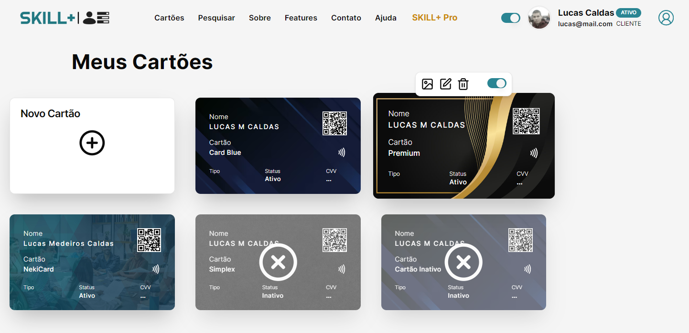
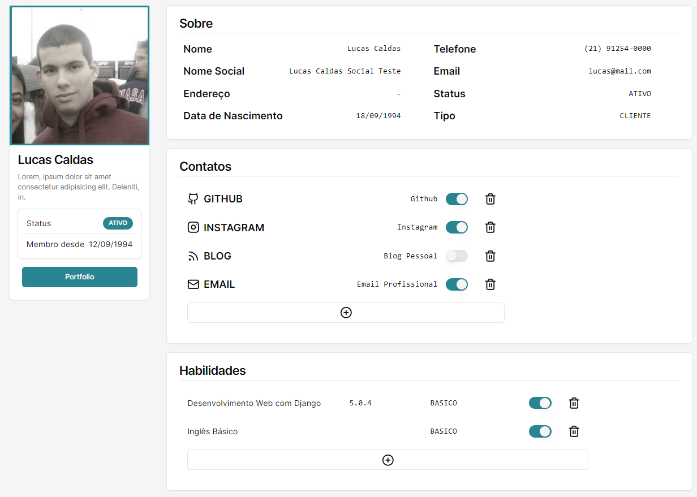
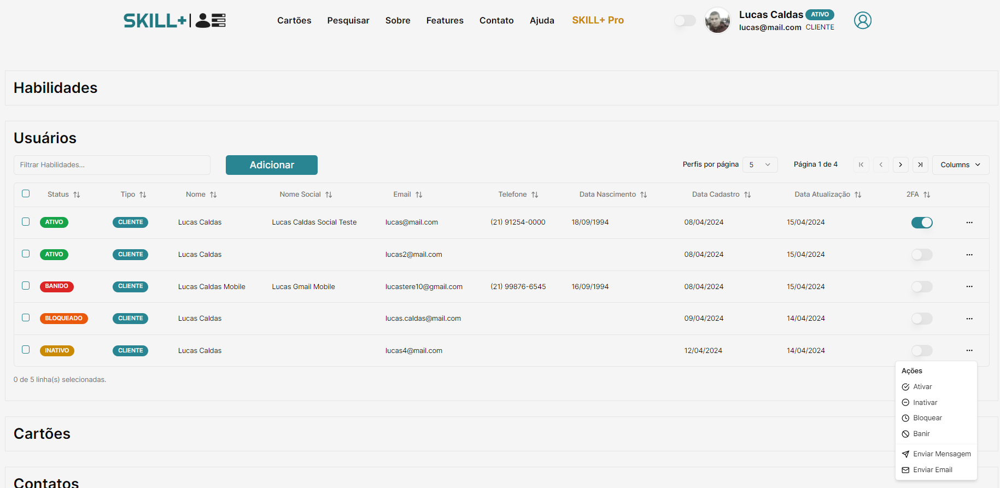

# SKILL+

## Descrição

Este projeto é uma aplicação frontend em Next.js 13 com Tailwind. É uma aplicação para compartilhamento de contatos e habilidades.

## Recursos

- Sistema de upload de foto e atualização de perfil.
- Possibilidade de adicionar habilidades ao perfil e torná-las privadas ou públicas.
- Possibilidade de adicionar contatos no perfil e torná-los privados ou públicos.
- Sistema de pesquisa de usuários, com as informações que o mesmo optou por deixar público.
- Sistema de cartões, podendo adicionar novos cartões com QR Code, ativar ou desativar, mudar informações e até imagem de background.
- Tela de admin para controle de habilidades, usuários, contatos e cartões.
- Paginação.

## Autenticação

Autenticação e autorização através do Next.js. Possui autenticação por credencial e login social utilizando Google e GitHub, além de um sistema de autenticação por QR Code ainda em testes.

## Tecnologias Utilizadas

- Next.js
- Tailwind
- Shadcn UI para criação de componentes.
- Axios para API.
- Next-themes para temas.
- React Hook Form para formulários.
- Yup para validação.
- Animações em Lottie.
- Socket.io-client.

## Em Desenvolvimento

- Sistema de filtros mais robusto.
- Sistema de mensagens em tempo real usando WebSockets.
- Sistema de envio de email.

## Telas


<br>

<br>

<br>

<br>

<br>

<br>

## Como Instalar

This is a [Next.js](https://nextjs.org/) project bootstrapped with [`create-next-app`](https://github.com/vercel/next.js/tree/canary/packages/create-next-app).

First, run the development server:

```bash
npm run dev
# or
yarn dev
# or
pnpm dev
# or
bun dev
```

Open [http://localhost:3000](http://localhost:3000) with your browser to see the result.

You can start editing the page by modifying `app/page.tsx`. The page auto-updates as you edit the file.

This project uses [`next/font`](https://nextjs.org/docs/basic-features/font-optimization) to automatically optimize and load Inter, a custom Google Font.

## Licença

----

## Learn More

To learn more about Next.js, take a look at the following resources:

- [Next.js Documentation](https://nextjs.org/docs) - learn about Next.js features and API.
- [Learn Next.js](https://nextjs.org/learn) - an interactive Next.js tutorial.

You can check out [the Next.js GitHub repository](https://github.com/vercel/next.js/) - your feedback and contributions are welcome!

## Deploy on Vercel

The easiest way to deploy your Next.js app is to use the [Vercel Platform](https://vercel.com/new?utm_medium=default-template&filter=next.js&utm_source=create-next-app&utm_campaign=create-next-app-readme) from the creators of Next.js.

Check out our [Next.js deployment documentation](https://nextjs.org/docs/deployment) for more details.
